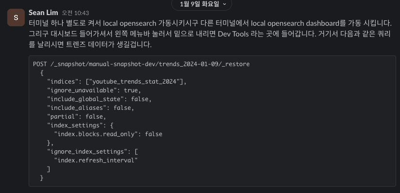
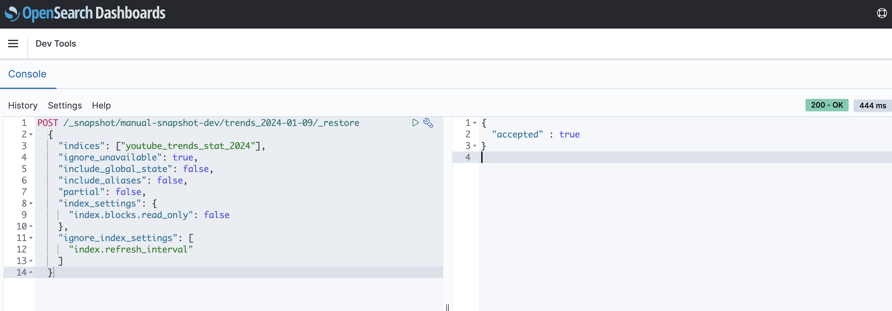
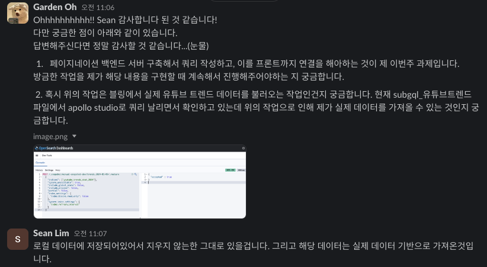

# Today I Learned, 2024.01.09 (TUE)

## Intro.

- 이번주에는 CoreTech팀의 Harry에게 일주일 동안 수행할 과제를 할당받았습니다.
- 현재 Vling 홈페이지에서 ```인기 급상승 동영상```페이지의 데이터 로딩 방식을 바꾸는 과제입니다.

## To do List

이번 과제의 구현 기능 목록은 다음과 같았습니다.

⛔️ 블링 서비스의 인급동 페이지는 현재 200개의 데이터를 페이지 로드시에 한번에 불러오고 있어 데이터 바인딩 속도가 매우 느립니다. 

이를 위해 다음과 같은 해결 방안이지 구현 기능 목록을 정의하였습니다.

[ ]  백엔드 서버 단에서 한 페이지당 20개씩 받아오도록 페이지네이션 기능을 구현합니다.

[ ]  백엔드 서버 구현에 맞게 쿼리 필드도 추가하여 수정합니다.

[ ]  프론트엔드 단에서 앞서 구현한 백엔드 기능을 추가하여 연결합니다.

## Today Report

#### 1. ```subgql_yttrends``` 폴더를 받고, 데이터를 먼저 로컬과 합쳤습니다.

저 혼자 데이터를 다룰 수 없는 부분이라, Sean과 Harry가 고안해주셨습니다. 따라서 Sean이 알려주신 방법으로 먼저 데이터를 불러왔습니다.



알려주신 내용을 templete_node의 _job 폴더에서 위의 명령어를 실행하면 됩니다. 

gateway를 실행할 수 있는 곳에서 실행해야함을 주의했습니다.

openresearch에서 쿼리를 날려 확인했습니다.



최종적으로 로컬에 잘 부착되었음을 확인했습니다.

#### 번외,,

위의 작업을 왜 진행해야하는지 궁금해져서 아래와 같이 여쭤보게 되었습니다.



제가 실제로 데이터를 받아오기 위해서 위의 작업을 진행하였다는 것을 이해했습니다.

그리고 보니 제가 해당 구현을 진행할 때마다 해주어야하더라고요,,, ㅜㅜ

### 2. 코드에 대하여 이해

제가 구현할 백엔드 서버를 어디에 구현할 지 폴더를 내려받고 코드를 공부했습니다.

코드를 보안 상 올릴 수 없으니 설명으로 대체해보겠습니다.

---
코드 분석 내용

#### 클래스 **`YoutubeTrends`**:

- **생성자**: 설정을 받아와 ES(엘라스틱서치) 인덱스명을 초기화하고 있다.
- **adjustPayload**: 가져온 데이터의 형식을 조정합니다. 예를 들어, 비디오 객체의 구조를 변환합니다.
- **getIndexIdGroups**: 주어진 기간 동안 필요한 ES 인덱스들을 찾아내는 기능을 합니다.
- **getTrendsData**: ES에서 인덱스에 맞는 데이터를 가져옵니다.
- **Runner**: 외부에서 호출되는 메인 함수입니다. 시간과 다른 매개변수를 기반으로 적절한 데이터를 찾아내고, **`adjustPayload`**를 통해 데이터를 반환합니다.

#### 주요 메서드:

- **`Runner`**: 주어진 매개변수에 따라 유튜브 트렌드 데이터를 가져오는 메인 프로세스를 실행합니다.

---

이 코드는 유튜브 인기 급상승 동영상의 데이터를 처리하는 데 사용되는 JavaScript 클래스 **`YoutubeTrends`**를 정의하고 있습니다. 코드의 각 부분을 세세하게 살펴보겠습니다.

#### **클래스 `YoutubeTrends`의 구조**

#### 1. **생성자 (constructor)**

- **`config`** 매개변수를 받아와 클래스의 인스턴스를 초기화합니다.
- **`super(config || {})`**: 상위 클래스 **`Singleton`**의 생성자를 호출하며, **`config`**가 없는 경우 빈 객체로 대체합니다.
- **`this.config = config;`** 현재 클래스 인스턴스의 설정을 저장합니다.
- **`this.ESNames = ESNames;`** Elasticsearch(ES) 인덱스 이름을 클래스 변수로 저장합니다.

#### 2. **adjustPayload(obj) 메서드**

- 이 메서드는 가져온 데이터의 구조를 조정합니다.
- **`obj.videos = obj.videos.map(...)`**: 데이터 객체 내의 **`videos`** 배열의 각 비디오 객체를 순회하며, 각 비디오 객체 내에 새로운 **`video`** 객체를 생성합니다. 이 객체는 오직 **`videoId`**만을 포함합니다.

#### 3. **getIndexIdGroups(prefixId, startDate, endDate) 메서드**

- Elasticsearch에서 쿼리할 인덱스 ID 그룹을 생성합니다.
- **`startDate`**부터 **`endDate`**까지의 기간 동안 각 시간대에 대한 인덱스 이름과 ID를 생성하여 반환합니다.
- 이 메서드는 주어진 날짜 범위에 대해 쿼리할 인덱스 이름을 생성하는 데 사용됩니다.

#### 4. **getTrendsData(indexIdGroups) 메서드**

- Elasticsearch에서 인덱스 ID 그룹에 해당하는 데이터를 가져옵니다.
- **`indexIdGroups`**에 있는 각 인덱스에 대해 Elasticsearch의 **`mget`** 쿼리를 수행합니다.
- 쿼리 결과를 **`rtn`** 배열에 병합하고, 첫 번째 결과를 반환합니다.

#### 5. **Runner(gl, section, section_sub, date, hour) 메서드**

- 이것은 클래스의 주요 실행 함수로, 외부에서 호출됩니다.
- 여러 조건을 기반으로 적절한 데이터를 검색하고, **`adjustPayload`**를 통해 조정된 데이터를 반환합니다.
- **`id`** 값을 기반으로 Elasticsearch에서 특정 데이터를 검색합니다.
- **`startDate`**와 **`endDate`**를 설정하여 해당 기간 동안의 데이터를 검색합니다.
- **`this.getIndexIdGroups`**와 **`this.getTrendsData`** 메서드를 사용하여 데이터를 검색하고 반환합니다.

#### **핵심 요약**

- 이 클래스는 유튜브의 인기 급상승 비디오 데이터를 처리하는 데 사용됩니다.
- Elasticsearch 쿼리를 위한 인덱스 ID를 생성하고, 필요한 데이터를 검색하여 구조를 조정합니다.
- **`Runner`** 메서드는 실제 데이터 처리의 핵심이며, 외부에서 데이터를 요청할 때 호출됩니다.

이 코드는 Node.js 환경에서 실행되며, 유튜브 데이터를 처리하고 GraphQL 서버에서 사용하기 위한 것으로 보입니다. Elasticsearch를 사용하여 데이터를 관리하고, GraphQL을 통해 클라이언트에 제공하는 구조를 가지고 있습니다.

---

여기서 

- **adjustPayload 함수**: 데이터를 클라이언트가 요구하는 형태로 변환합니다. 이는 데이터를 사용하기 쉽고 의미 있게 만드는 데 필요합니다.
- **날짜 기반의 데이터 쿼리**: 유튜브 데이터는 시간에 따라 변화합니다. 이 코드는 특정 시간대의 데이터를 검색하고 처리할 수 있도록 설계되었습니다.

#### **결론**

이 코드는 유튜브의 인기 급상승 데이터를 효율적으로 가져오고, 사용자에게 필요한 형태로 제공하기 위해 설계되었습니다. Elasticsearch는 데이터 처리의 효율성과 속도를 높이기 위해, GraphQL은 유연하고 효율적인 데이터 제공을 위해 사용되었습니다. 이러한 기술적 선택은 데이터 중심의 서비스에서 일반적으로 발견되는 요구 사항을 반영합니다.

gpt를 통해 로직 이해를 진행할 수 있었습니다.

---
## 오늘의 요약

- 데이터를 부착하는 방법에 대해서 실습했습니다. 여기서 opensearch를 확인하기도 했습니다.

- 백엔드 코드 (쿼리, 리졸버, 메인 함수)를 공부했습니다.

- 기존 프로젝트에서 구현한 페이지네이션 함수 구현방법을 검토하고 구현 목록을 정의했습니다.