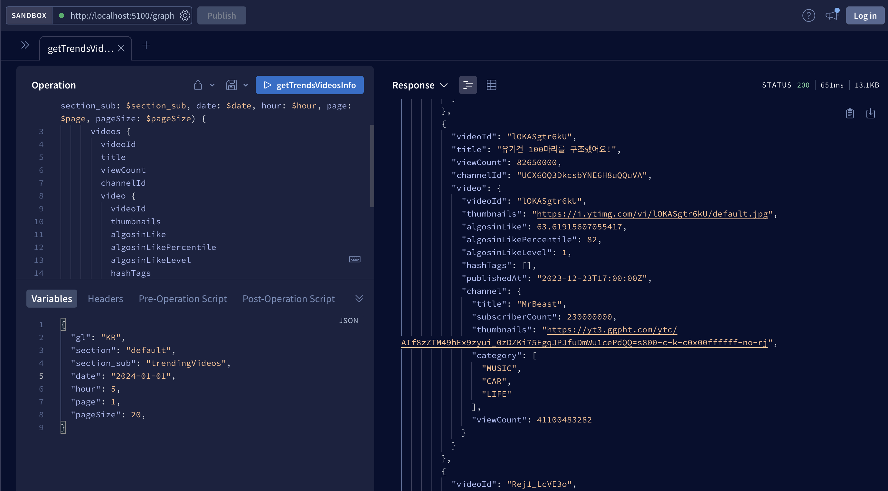

# Today I Learned, 2024.01.10 (WED)

## Intro.

- 이번주 과제를 구현하기 위해서 오늘은 본격적으로 구현을 시작했습니다.
- 어제 제가 기존에 진행했던 motus 프로젝트에서 페이지네이션이 구현된 백엔드 코드를 살펴보면서 ```어떠한 방식``` 으로 구현을 해야하는지 로직을 이해했습니다.
- 따라서 오늘 구현을 진행하기 전에 백엔드 구현 기능 목록을 정의했습니다.

## To do List

본격적으로 오늘은 백엔드 구현 기능 목록을 진행할 예정입니다. 

우선 어떻게 구현해야 페이지네이션 기능이 잘 구현되는지 공부하고 이를 최종적으로 아래에 정의하였습니다.

- [ ] 전체 데이터에서 먼저 조회수가 높은 순서대로 정렬해야합니다.

- [ ] 조회수가 높은 순서대로 정렬된 상태에서 20개씩 분할 되어야합니다.

## Today Report

### 1. 데이터 목록 확인

- 인급동 데이터 목록을 확인하여 전체 데이터를 확인해보았습니다.
- 1위부터 200위까지 총 200개의 전체 데이터 목록을 확인했고, 이를 20개씩 페이지네이션을 적용해 불러와야함을 확인했습니다.

### 2. 백엔드 쿼리 정의 (src/graphql/YoutubeTrends/default.graphql)

- 먼저 graphql 파일을 열고 제가 구현하려는 페이지네이션 변수를 선언해주었습니다.

```javascript
type Query {
  getTrendsVideosInfo(
    gl: String,
    section: String,
    section_sub: String,
    date: String,
    hour: Int,
    page: Int, //추가됨     
    pageSize: Int  //추가됨   
  ): TrendsVideosInfo
}
```

### 3. 리졸버에도 argv 정의 (src/graphql/YoutubeTrends/default.resolver.js)

- 리졸버 함수에도 제가 구현하려는 변수에 대해 argv를 정의해주었습니다.

```javascript
import YoutubeTrends from "./YoutubeTrends";

export const resolvers = {
  Query: {
    getTrendsVideosInfo: async (_, args, context, info) => {
//생략
      return await new YoutubeTrends(Config.get()).Runner(
        args.gl,
        args.section,
        args.section_sub,
        args.date,
        args.hour,
        args.page,      // 추가
        args.pageSize,  // 추가
        GqlFunction.getSelections(info)
      );
    },
  },
};
```

### 4. 메인 함수 구현

```javascript
//생략

const ESNames = Object.freeze({
  Index: `youtube_trends_stat`,
});

export default class YoutubeTrends extends Singleton {
  constructor(config) {
//생략
  }

  adjustPayload(obj) {
  //생략
  }

  async getIndexIdGroups(prefixId, startDate, endDate) {
//생략
  }

  async getTrendsData(indexIdGroups, page, pageSize) {
    let allVideos = [];
  
    for (const index of Object.keys(indexIdGroups)) {
//생략
      }
    }
  
    // 모든 비디오를 viewCount로 정렬
    allVideos.sort((a, b) => b.viewCount - a.viewCount);
  
    // 페이지네이션 적용
    const startIndex = (page - 1) * pageSize;
    const paginatedVideos = allVideos.slice(startIndex, startIndex + pageSize);
  
    return { videos: paginatedVideos, page, pageSize, total: allVideos.length };
  }
  

  async Runner(gl, section, section_sub, date, hour, page = 1, pageSize = 20) {
//생략
  
      let dslQuery = {
        index: `${this.ESNames.Index}_${date.split("-")[0]}`,
        type: "_doc",
        body: {
          query: {
            match: {
              _id: id,
            },
          },
          from: from,  // 페이지네이션을 위한 시작 위치를 나타내는 시작문. 근데 page-1을 해야하는데 왜 null오류가 뜰까..........
          size: size   // 페이지당 불러오는 데이터의 수를 정의하였당
        },
      };

//생략

      if (result.body.hits.hits[0]) {
        let videos = result.body.hits.hits[0]._source.videos;
  
        // 조회수에 따라 비디오 배열 정렬
        videos.sort((a, b) => b.viewCount - a.viewCount);
  
        // 페이지네이션 적용
        const startIndex = (page - 1) * pageSize;
        const paginatedVideos = videos.slice(startIndex, startIndex + pageSize);
  
        // 정렬된 비디오와 페이지 정보로 구성된 새로운 payload 생성
        let payload = {
          ...result.body.hits.hits[0]._source,
          videos: paginatedVideos,
          page: page,
          pageSize: pageSize
        };
  
        return this.adjustPayload(payload);
      }
    }
    
//생략

    // trendsData에 page와 pageSize 정보를 추가해서 응답값 확인해보려고 했는데 안뜸
    let response = this.adjustPayload(trendsData);
    response.page = page;
    response.pageSize = pageSize;
    
    //console.log(response);

    // response 객체가 올바른 구조를 가지고 있는지 확인하려고 했는데 안뜸
    if (!response.page || !response.pageSize) {
    console.error("Missing page or pageSize in response");
  }
  
    return response;

```

보안 상 생략된 코드가 많지만 페이지네이션 구현한 부분(내가 구현한 부분)을 살펴보자.

사용자가 데이터를 요청시 전체 데이터를 요청 후, 조회수가 높은 순서대로 나열하고 이다음에 20개씩 분할 요청하는 것으로 구현하였다.

## 버그 해결(트러블 슈팅)

- 위와 같이 구현하였고, 데이터가 올바르게 잘 로드 되는 것을 확인했습니다.
- 하지만 버그가 발생했습니다. 첫 페이지 로드시에는 20개만 잘 보여지지만 1번의 ```더보기``` 버튼을 클릭 시에 추가로 20개의 데이터만 불러와야하는데 , 40개의 데이터가 불러와집니다...

이 버그를 수정하였습니다.

```javascript

      let dslQuery = {
        index: `${this.ESNames.Index}_${date.split("-")[0]}`,
        type: "_doc",
        body: {
          query: {
            match: {
              _id: id,
            },
          },
          //from,size를 생략함.
        },
      };
```
이 버그 해결 과정을 요약하자면, 리턴되는 쿼리 형식을 맞춰주지 않아서였습니다 ^^,,,, 참내...

## 오늘의 요약
- 백엔드 서버 구현 완료
- 아폴로 스튜디오에서 확인 완료

아래의 화면으로 데이터를 받아온 것을 확인할 수 있습니다 ^_^(자랑스럽다!!)

