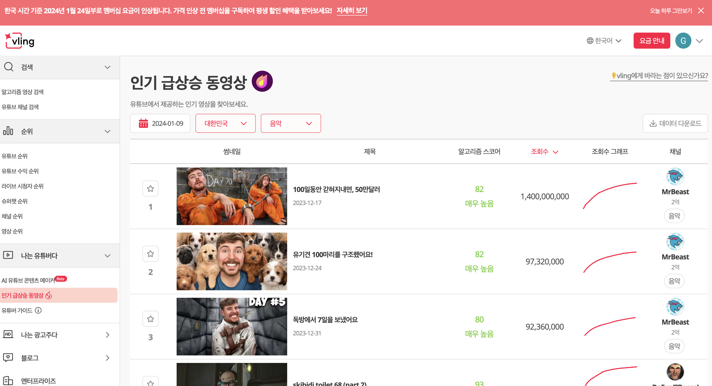

# Today I Learned, 2024.01.12 (FRI)

## Intro.

- 오늘은 어제 만들었던 서버를 프론트엔드로 연결하는 것을 목표로 하였습니다. 
- 본격적으로 프론트엔드 기능 구현을 마무리 진행하였습니다.

## To do List

## 1. 버그 해결
### ⛔️ [버그 발생 1] 

- 첫 새로고침 시 19개의 데이터만 불러와짐 단위가 20이 아니고 19개가 불러와짐


### ⛔️ [버그 발생 2]

- 카테고리 적용이 아예 되지 않음...




### 버그 발생 분석

데이터 중에 알고신 데이터의 값이 0인 친구들을 보여지게 하지 않는 기능이 있었습니다. 

원래는 한꺼번에 200개의 데이터를 받아오고, 이를 가지고 프론트에서 20개씩 잘라서 리턴해줬습니다.

하지만 현재는 20개씩 요청을 보내다보니 데이터의 값이 0인 친구들을 누락시켜서 해당 버그들이 발생했습니다.

### 버그 해결

Harry께서 Dorru와 함께 논의하신 후 페이지네이션 기능 구현을 위해 우선 모든 데이터를 다 불러오도록 하기로 했습니다.

필터되는 기능을 아래와 같이 삭제하였습니다.

```javascript
// 알고리즘 스코어 0점인경우에 데이터 목록에서 빠지는 거 조건 삭제 > page 때문에 그렇게 되었습니다...
  const formatVideoList = (videoList) => {
    let result = [];
    if (videoList) {
      videoList.map((videoData) => {
        let _newData = { ...videoData, ...videoData.video };
        delete _newData.video;
        result.push(_newData);
      });
    }
    return result;
  };
```

## 2. 프론트엔드 구현을 완성하였습니다.

### [1] 쿼리 수정 (packages/shared-gql/youtubeTrends/youtubeTrends.gql.js)

프론트에서 백엔드로 쿼리를 요청할 때, 해당 쿼리 형식을 동일하게 맞춰주었습니다.

```javascript
//생략
export const getTrendsVideosInfo = gql`
  query getTrendsVideosInfo($gl: String, $section: String, $section_sub: String, $date: String, $hour: Int, $page: Int, $pageSize: Int) {
    getTrendsVideosInfo(gl: $gl, section: $section, section_sub: $section_sub, date: $date, hour: $hour, page: $page, pageSize: $pageSize) {
      videos {
        //생략
        video {
          //생략
          channel {
            //생략
          }
        }
      }
    }
  }
`
```

### [2] 데이터 연결하는 함수 기능 구현

```javascript
//생략..

  const currTime = new Date(new Date().getTime() + 1000 * 60 * 60 * 9).toISOString().split('T')[0]
  const daysAgo = new Date(currTime)
  daysAgo.setDate(daysAgo.getDate() - 3)
  const _date = query.date == undefined ? daysAgo.toISOString().split('T')[0] : query.date
  const _hour = new Date(currTime).getUTCHours()

  const isValidDate = () => {
    const dateLimit = () => {
      let limit = new Date(daysAgo)
      switch (membership) {
        case 'normal':
          break
        case 'standard':
          limit = new Date(limit.setMonth(limit.getMonth() - 1))
          break
        case 'premium':
        case 'professional':
        case 'enterprise':
          limit = new Date('2022-10-15')
          break
      }
      return limit.toISOString().split('T')[0]
    }

    return new Date(_date) >= new Date(dateLimit()) && new Date(_date) <= new Date(daysAgo)
  }

  const variables = {
    gl: query?.nations ? query?.nations : 'KR',
    section: query?.category ? query?.category : 'default',
    section_sub: 'trendingVideos',
    date: _date,
    hour: _hour,
  }
// 알고리즘 스코어 0점인경우에 데이터 목록에서 빠지는 거 조건 삭제 > page 때문에 그렇게 되었습니다...
  const formatVideoList = (videoList) => {
    let result = [];
    if (videoList) {
      videoList.map((videoData) => {
        let _newData = { ...videoData, ...videoData.video };
        delete _newData.video;
        result.push(_newData);
      });
    }
    return result;
  };
  
  const sortVideoList = (videoList) => {
    let _videoList = []
    const sort = query?.sort ? query.sort : 'viewCount'
    if (sort === 'viewCount') _videoList = [...videoList].sort((a, b) => b?.viewCount - a?.viewCount)
    else if (sort === 'algosinLike') _videoList = [...videoList].sort((a, b) => b?.algosinLike - a?.algosinLike)
    return _videoList
  }

  useEffect(() => {
    const fetchTrends = async () => {
      setIsLoading(true);
      const { data, loading } = await getTrendVideos({
        variables: {
          ...variables,
          page: 1,
          pageSize: 20,
        },
      });
  
      if (!loading && data) {
        const newVideos = formatVideoList(data.getTrendsVideosInfo.videos);
        setVideoList(newVideos);
        setIsMoreButton(data.getTrendsVideosInfo.videos.length === 20);
      }
      setIsLoading(false);
    };
  
    fetchTrends();
  }, [query?.nations, query?.category, query?.date]);
  
  const fetchMore = async () => {
    if (isMoreButton && !isMoreLoading) {
      setIsMoreLoading(true);
  
      const nextPage = currentPage + 1;
  
      const { data, error } = await getTrendVideos({
        variables: {
          ...variables,
          page: nextPage,
          pageSize: 20,
        },
      });
  
      if (error) throw error;
      if (!data || data.getTrendsVideosInfo.videos.length === 0) {
        setIsMoreButton(false);
      } else {
        setVideoList(prev => [...prev, ...formatVideoList(data.getTrendsVideosInfo.videos)]);
        setIsMoreButton(data.getTrendsVideosInfo.videos.length === 20);
        setCurrentPage(nextPage);
      }
  
      setIsMoreLoading(false);
    }
  };
  

  useEffect(() => {
    if (videoList && isValidDate()) setVideoList(sortVideoList(videoList))
    // eslint-disable-next-line react-hooks/exhaustive-deps
  }, [query])

  // 기존 코드와 비슷하게 추가적인 데이터 로직 구현!!(requestMoreList)
  const requestMoreList = async () => {
    if (auth?.authData?.sub) {
      if (!checkGradeLimit(auth?.authData?.membership?.grade)) return;
  
      setIsMoreLoading(true);
  
      await fetchMore();
  
      setIsMoreLoading(false);
    } else {
      setAuthFlow({ auth_type: 'sns', auth_flow: 'sign_in', where: 'header' });
    }
  };

  const checkGradeLimit = (grade) => {
//생략
    return true;
  };

  return { videoList, isLoading, isMoreButton, isMoreLoading, fetchMore: requestMoreList }

```
기존 코드 형식과 비슷하게 구현하려고 노력했습니다 ^_^

## 구현 완성


ㅋㅋㅋㅋㅋ 완성했습니다!