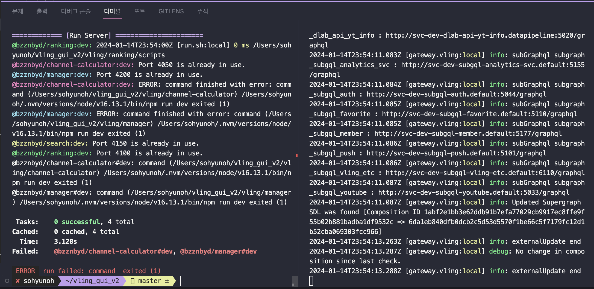

# Today I Learned, 2024.01.15 (MON)

## Intro.

- 오늘은 제가 구현한 페이지네이션 기능에 대하여 정리해보는 시간을 가져보겠습니다.

## Issue.

말썽쟁이인 저는 오늘 아침부터 또 에러가 났습니다,,, 어휴

원인은 터미널을 제대로 종료하지 않아서 계속 포트가 열려있는 상태가 되어가지고 이걸 종료하기로 했습니다. ^^...



저기 에러 메세지를 보면 포트 번호 

- 4050 / 4100 / 4150 / 4200 포트는 이미 사용중이라고 표기되어있어서 각각 포트의 프로세스 번호를 확인하고 kill명령어를 실행하면 됩니다.

1. 4050 포트 확인 진행

```lsof -i tcp:4050```

해당 명령어를 실행하였더니 4050 포트를 사용중인 프로세스의 정보를 출력하였습니다. 출력되는 정보들 중에서 PID를 찾습니다.

2. 프로세스 종료

```kill PID```

그 다음에 kill 명령어를 사용하여 이 프로세스들을 모두 종료해야합니다. 

이 과정은 모든 포트에서 다 실행하고 kill명령어를 사용해 종료하면 해당 에러가 종료됩니다.

## Main.

이번 과제의 구현 기능 목록은 다음과 같았습니다.

⛔️ 블링 서비스의 인급동 페이지는 현재 200개의 데이터를 페이지 로드시에 한번에 불러오고 있어 데이터 바인딩 속도가 매우 느립니다. 

이를 위해 다음과 같은 해결 방안이자 간단하게 구현 기능 목록을 정의하였습니다.

- [ ]  백엔드 서버 단에서 한 페이지당 20개씩 받아오도록 페이지네이션 기능을 구현합니다.
- [ ]  프론트엔드 단에서 앞서 구현한 백엔드 기능을 추가하여 연결합니다.

### BackEND.

우선 제가 구현한 백엔드 서버 구현 내용을 살펴보겠습니다.

 **인급동 백엔드 구현 코드 보고서**


저는 앞선 기능들을 구현하기 위해서 백엔드 코드를 다음과 같이 구현하였습니다.

구현한 백엔드 폴더의 이름은 **subgql_yttrends 입니다.**

**1. 쿼리 정의(src/graphql/YoutubeTrends/default.graphql)**

```
type Query {
  getTrendsVideosInfo(
    gl: String,
    section: String,
    section_sub: String,
    date: String,
    hour: Int,
// 이 부분이 필드 추가 내용입니다. 현재 페이지를 나타내는 page 변수와 
// 한 페이지당 얼만큼의 데이터를 불러오는지 크기를 정의하는 pageSize 입니다.
    page: Int,        
    pageSize: Int     
  ): TrendsVideosInfo
}
```

이 쿼리의 구조는 아래와 같은 apllo studio에서 확인해볼 수 있습니다.(클라이언트에서도 확인 가능)

```
query getTrendsVideosInfo($gl: String, $section: String, $section_sub: String, $date: String, $hour: Int, $page: Int, $pageSize: Int) {
    getTrendsVideosInfo(gl: $gl, section: $section, section_sub: $section_sub, date: $date, hour: $hour, page: $page, pageSize: $pageSize) {
      ..생략^^...
```

위의 쿼리 구조를 가지고 있습니다.

**2. 리졸버 함수 정의 (src/graphql/YoutubeTrends/default.resolver.js)**

리졸버 함수를 정의하였습니다. 기존 코드에 페이지 변수들 args만 추가해주면 되었습니다(매우 다행)

**3. 메인**

메인에서 본격적으로 페이지네이션 기능을 구현해주었습니다

```코드는 비밀,,인것으로...```

### FrontEND.

  **인급동 프론트엔드 구현 코드 보고서**

앞서 구현한 백엔드 내용과 연결하기 위해서 다음과 같이 프론트 코드를 구현하였습니다.

프론트엔드 코드는 vling_gui_v2 폴더 내에서 구현하였습니다.

**1. 프론트엔드 받는 쿼리 정의(packages/shared-gql/youtubeTrends/youtubeTrends.gql.js)**

백엔드로부터 받아오는 쿼리 구조에 맞춰서 올바르게 정의하였습니다.

```
export const getTrendsVideosInfo = gql`
  query getTrendsVideosInfo($gl: String, $section: String, $section_sub: String, $date: String, $hour: Int, $page: Int, $pageSize: Int) {
    getTrendsVideosInfo(gl: $gl, section: $section, section_sub: $section_sub, date: $date, hour: $hour, page: $page, pageSize: $pageSize) {
    //생략...
```

**2. 프론트엔드 기능 구현**

프론트엔드 메인 기능 구현을 개발했습니다. 

백엔드 코드에서는 기존에 기능이 구현된 것에 추가적으로 기능을 추가한 것이었는데, 프론트엔드 코드는 이미 구현된 내용을 수정해서 제가 추가한 기능을 녹여내는 것이었습니다. 

기존 이 코드를 살펴보면 모든 데이터를 다 받아오고, 프론트에서 20개씩 잘라서 보여주도록 코드가 구현되어있습니다. 이를 수정하고 백엔드 구현 내용을 보면서 (명세를 따로 작성하지 않았기에,,,) 올바르게 구현을 진행했습니다.

코드는 또 비밀입니다,,헤헤

## 최종 결과 화면!!


## 번외,,, 따듯한 격려의 말씀,,,

감사합니다ㅎㅎ