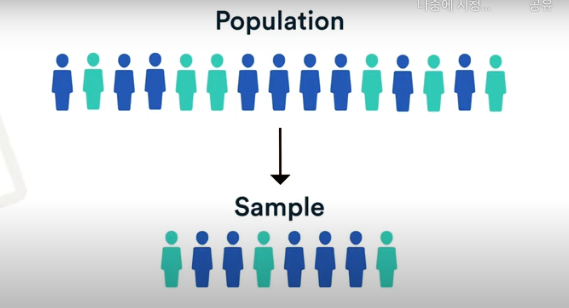

# Today I Learned, 2024.01.16 (TUE)

## Intro.

오늘은 새로운 한 주차의 (1/1이 월요일이어서 ^^..) 시작이어서 새로운 개발 멘토님인 DLAB의 Sean에게 새로운 과제를 할당받았습니다.

제 이번주 과제는 다음과 같습니다.

# 이번주의 과제

- [ ] 1. workflows/src/modules/DevSampling > 코드 검토 / 추가적인 개선 
- [ ] 2. workflows/k8s/DevSampling/prod.gke.cronjob.yaml 에서 kind: CronJob을  Cronworkflow로 변환

생각보다 간단해보이지만 정말 어려운 작업입니다... 사실 코드도 잘 모르겠어서 오늘 하루 종일 분석만 하다가 퇴근했습니다 ^_^

# 오늘의 목표 ⛳️

- [ ]  DevSampling 코드들 상세 분석

먼저 DevSampling 폴더 안에는 아래와 같이 파일구조가 만들어져있다.

```
DevSampling-
					 ㄴ ChannelSampleCount.js
					 ㄴ ChannelTotalCount.js
					 ㄴ index.js(메인함수)
					 ㄴ SampleBase.js
					 ㄴ SampleChannelInfo.js
					 ㄴ SampleChannelStat.js
					 ㄴ SampleChannelSubLevel.js
					 ㄴ SampleVideoInfo.js
					 ㄴ SampleVideoStat.js
					 ㄴ Snapshot.js
```

오늘은 README.md를 보면서 메인인 index.js 코드를 분석하고자 합니다.

# 오늘 공부한 내용 ✏️ 

## [1] index.js 분석하기

이 코드는 전반적으로 유튜브 채널과 관련된 데이터를 샘플링하는 작업을 수행하고 있었습니다.

우선 환경 변수 부분이 상단에 위치해서 한번 먼저 살펴보겠습니다.

### 1. **process.env**

이 파일에서는 `process.env` 를 사용 해서 환경 변수에서 설정값을 읽어들이고 있었습니다. 이 변수에 대해 알아보니, 보통 외부에서 이 웹서비스의 설정을 관리할 때 사용된다고 하였습니다. 코드 일부를 발췌해서 예시로 살펴보겠습니다.


```
const CONST_SRC_CHANNEL_INFO = process.env.CONST_SRC_CHANNEL_INFO || "youtube_channel_info";
const ESSrcChannelInfo = Object.freeze({ Index: CONST_SRC_CHANNEL_INFO, });
```

여기서 `CONST_SRC_CHANEL_INFO`  는 YouTube 채널 정보와 관련된 소스 인덱스를 나타내고 있습니다.

여기서 이 친구의 역할이 더 궁금해졌기에 더 상세히 조사해보았습니다. 

`CONST_SRC_CHANEL_INFO`  는  YouTube 채널 정보와 관련된 데이터베이스나 파일의 인덱스를 지정할 수 있습니다. 개발 환경에서는 테스트용 인덱스를, 실제 운영 환경에서는 실제 데이터 인덱스를 사용하도록 설정할 수 있습니다. 이렇게 함으로써, 애플리케이션을 다양한 환경에서 보다 쉽고 안전하게 운영할 수 있습니다.

인덱스 개념을 프리온보딩 과정에서 Sean이 알려주신 내용을 참고해서 다시 공부해보았습니다.

---

> 번외 : 인덱스에 대하여,,,

dlab에서? 아니, 데이터에서의 **“인덱스”**는,

데이터베이스나 파일 시스템에서 쓰이는 인덱스는 특정 데이터의 위치나 참조를 나타내는 용어로 이해할 수 있다.

- 데이터 베이스 인덱스: 데이터베이스에서의 “인덱스”는 특정 테이블에 저장된 데이터를 빠르게 찾을 수 있도록 도와주는 데이터 구조입니다. 예를 들어, `YouTube 채널 정보` 데이터베이스 테이블이 있다면, 이 테이블에 인덱스를 설정함으로써 특정 채널의 정보를 더 빠르고 효율적으로 검색할 수 있습니다.
- 파일 인덱스: 파일 시스템에서는 “인덱스”가 파일이나 디렉토리의 위치를 가리킬 수 있습니다. 예를 들어, 파일 시스템에서 특정 데이터 파일의 위치를 참조하는 것을 인덱스라고 할 수 있습니다.

이런식으로 현 코드에서 환경 변수를 통해 저희의 애플리케이션의 실행 환경에 따라 다른 데이터 소스를 참조하도록 설정함으로써, 개발과 운영 환경을 분리하고 관리하는데 유용할 수 있습니다.

이상 번외 끝~

---

### 2. DevSampling Class

- 이 클래스에서는 yargs를 사용하여 커맨드 라인 인터페이스(CLI)를 정의하는데, 이를 통해 사용자는 커맨드 라인에서 다양한 옵션을 설정할 수 있도록 돕는 역할을 합니다.
- run 메소드에서는 실제 샘플링 로직이 구현됩니다. 채널 정보를 가져오거나, 샘플링 비율을 계산하는 작업 등의 작업이 이루어지고 있었습니다.

ㅎㅎ 잘 이해가 되지 않았기에 더 상세히 조사해보았습니다. 

먼저  **`yargs`와 커맨드 라인 인터페이스** 에 대해 자세히 공부해보았습니다.

---

> 번외 : yargs와 CLI에 대하여,,,

먼저 개념을 우선적으로 알아보겠습니다.

1.  CLI란?


- 커맨드 라인 인터페이스는 사용자가 텍스트 기반 명령어를 입력하여 컴퓨터 프로그램과 상호작용을 하는 방식입니다. 우리가 흔히 사용하는 cmd나 리눅스의 터미널이 이에 해당됩니다.

2.  yargs 라이브러리?


- **`yargs`**  는 Node.js에서 CLI를 만들기 위한 라이브러리 입니다. 이를 통해서 개발자는 사용자가 명령어를 입력할 때 다양한 옵션을 쉽게 지정할 수 있도록 해준다고 합니다.

간단하게 각각의 기초 개념을 알아보았고, 저희 코드에서 살펴보겠습니다.

 ****DevSampling 클래스에서의 yargs 사용****

- **옵션 정의**: **`DevSampling`** 클래스에서, **`yargs`**는 사용자가 프로그램을 실행할 때 여러 가지 옵션을 설정할 수 있도록 돕습니다. 예를 들어, 샘플링 비율을 설정하거나 특정 데이터를 선택하는 옵션 등이 이에 해당합니다.
- **동작 방식**: 프로그램이 실행될 때, **`yargs`**는 입력된 명령어의 구조를 분석하고, 설정된 옵션에 따라 다른 동작을 수행하도록 프로그램에 지시합니다.
- **예시**: 사용자가 커맨드 라인에서 **`npm start DevSampling --sampleRatio=5`**라고 입력하면, **`yargs`**는 **`sampleRatio`** 옵션을 **`5`**로 설정하고, 이 정보를 **`DevSampling`** 클래스에 전달합니다. 그런 다음 클래스는 이 값을 사용하여 샘플링 비율을 결정합니다.

공부를 하다가 쉬운 예시로 이해를 해보았는데 미래의 저를 위해 한번 작성해보겠습니다^^,,,

4. 쓰기도 민망한 쉬운 비유 예시

CLI는 마치 식당에서 직원분에게 주문을 하는 것과 유사합니다. 여기서 직원분이 **`yargs`**  라고 할 수 있고, 제가 “알리오올리오 파스타, 대신 홍합이랑 마늘은 빼주세요” 라고 주문하면 직원분은 이 주문을 정확하게 이해하고 주방에 전달합니다. 마찬가지로 **`yargs`**는 사용자가 입력한 텍스트 명령어를 해석하여 프로그램이 이를 이해하고 실행할 수 있도록 도와주고 있습니다.


이상 번외 끝 ~~

---

오케이 우리는 yargs가 어떤 역할을 하는 개념인지를 이해했습니다. 

다만 이 프로그램에서 왜 사용되는지가 궁금했습니다. 사용자가 여기서 텍스트 명령어를 입력해 무엇을 하기에 이걸 쓰는지 궁금했기 때문에 조사를 했습니다.


#### 🔎 번외, 여기서 왜 yargs를 사용하는 건가요?

사용자가 CLI를 통해 프로그램에 옵션을 전달할 수 있게 하는 것입니다. 사용자가 특정 데이터를 샘플링 하고자 할대, 어떤 데이터를 어느 정도의 비율로 샘플링을 할지 CLI에서 명령어를 통해 지정할 수 있습니다.

####  **✅ `DevSampling` 클래스에서의 yargs 구현 내용**

**`DevSampling`** 클래스는 YouTube 채널과 관련된 데이터를 샘플링하는 작업을 자동화합니다. 여기서 **`yargs`**는 아래의 3가지 정도의 목적으로 사용됩니다.

1. **샘플링 비율 설정**: 사용자가 샘플링할 데이터의 비율을 명령어를 통해 지정할 수 있습니다. 예를 들어, 전체 데이터의 5%만 샘플링하고 싶다면, 사용자는 커맨드 라인에서 이를 지정할 수 있습니다.  **`sampleRatio`**

2. **특정 작업 스킵**: 사용자는 특정 데이터 샘플링 작업을 스킵할 수 있는 옵션을 지정할 수 있습니다. 예를 들어, 비디오 정보 샘플링은 하고 싶지만 채널 통계 샘플링은 하고 싶지 않은 경우, 이를 명령어로 지정할 수 있습니다. **`skip-ch-?`**  부분입니다!

3. **타겟 날짜 지정**: 특정 날짜에 대한 데이터만 샘플링하고 싶은 경우, 사용자는 그 날짜를 명령어를 통해 지정할 수 있습니다. targetDate  부분입니다!

### 3. Run 메소드

YouTube 채널과 관련된 데이터 샘플링 작업들이 이루어지는 메소드입니다.

1. **데이터 샘플링 실행**: 여러 데이터 소스에서 정보를 샘플링합니다. 이는 채널 정보, 채널 통계, 비디오 정보 등을 포함할 수 있습니다.


2. **옵션에 따른 실행**: run 메소드는 사용자가 yargs를 통해 입력한 옵션에 따라 다르게 동작합니다. 예를 들어, 사용자가 특정 데이터 샘플링을 스킵하도록 지시했다면, run 메소드는 해당 작업을 수행하지 않도록 구현되어있습니다.


3. **작업 순서 관리**: run 메소드는 데이터 샘플링 작업의 순서와 방법을 관리합니다. 예를 들어, 먼저 채널 정보를 샘플링한 후 채널 통계를 샘플링하는 등의 순서를 결정하도록 구현되어있었습니다.

### 4. 데이터 샘플링 …

학부 수업 중 빅데이터개론에서 간단하게 배운 데이터 샘플링을 더 공부해보았습니다.

---

> 번외: 데이터 샘플링이란?

**데이터 샘플링이란?,,,**

데이터 샘플링이라는 개념에 대해 상세하게 정리합니다.

샘플링이란 간단하게 말해서 데이터의 표본을 추출하는 기법입니다. 가장 중요한 점은 표본수, 즉 샘플수를 과연 몇 개를 해야하는지 판단하는게 데이터를 유용하게 다룰 수 있습니다.

우리는 데이터 샘플링을 왜 해야할까요? 모집단의 특성을 알기 위해 모집단 전체에 대한 검증을 하기는 현실적으로 어려운 경우가 많습니다. 그래서 우리는 **모집단에서 표본을 추출하여 테스트를 진행하고, 이를 통해 모집단의 특성을 추정하게 됩니다.** 

특히 이 개념을 이해하는데 많은 도움을 받은 영상이고, 영상을 바탕으로 공부해보았습니다.

https://www.youtube.com/watch?v=huVsdOZkeTc



- 이 그림과 같이 모집단은 결론을 도출하려는 전체 그룹인 반면(Population), 우리가 샘플링을 하여 추출한 부분을 실제로 데이터를 수집할 소규모 개인 그룹이라고 정의해 볼 수 있습니다.

- 모집단을 정의하는 방법 / 표본 선택 전략 중요하다고 생각합니다.


모집단을 더욱 정확하게 정의할수록 대표 표본을 수집하는 것이 더욱 쉬워진다고 이해할 수 있습니다.

표본을 선택하는 방법에는 **확률 표본 추출**과 **비확률 표본 추출**이라는 두 가지 주요 접근 방식이 있습니다.

여기서 확률 샘플링은 무작위 방법을 사용하여 표본을 선택하는 것을 의미합니다. 

비확률 표본 추출은 무작위가 아닌 방법으로 표본을 선택된다는 것을 의미합니다.

샘플링 방법은 결과를 모집단 전체에 얼마나 확실하게 일반화 할 수 있는지에 영향을 미칩니다.


|  | 표본을 선택하는 방법 2가지! |  |
| --- | --- | --- |
| 제목 | 확률 표본 추출(확률 샘플링) | 비확률 표본 추출(비확률 샘플링) |
| 간단히! | 무작위 방법 | 무작위가 아닌 방법 |
| 장단점 | - 표본이 대표성이 있고 편견이 없는지 확인하는데 도움됨. | - 달성하기는 확률 샘플링보다 훨씬 쉬운데 편향 위험이 높음 |
|다양한 방법 |1. 단순 무작위 표본 추출 / 체계적 표본 추출 <br/> : 전체 모집단에서 완전히 무작위로 표본을 선택합니다. <br/> 2. 계층화된 샘플링 : 모집단을 하위 그룹으로 나누고, 각 하위 그룹에서 무작위 표본을 추출합니다. <br/>  3. 클러스터 샘플링 : 모집단을 샘플에 대해 클러스터(지리적 영역)으로 나누고  이러한 클러스터들 중 일부를 무작위로 선택하고 있습니다. | |
|의미 | 이러한 방법은 매우 작고 접근 가능한 인구를 다루지 않는 이상은 실제로 달성하기가 매우 어렵다고 하네요,,,, | |

## 키야 CHOI의 조언!!

디랩의 최강 개발자 CHOI가 첨삭해주셨는데 그냥 이렇게 딥하게 알아볼 필요 없이 엄청난 양의 데이터들 중에서 데이터의 표본을 추출한다고만 알고 있어도 되신다고 하네요,, 매우 다행입니다,,


# 왜 이 데이터 샘플링을 진행하는가?

이것에 대한 답변은 ETHAN, SEAN, CHOI 께서 직접 말씀해주셨습니다 (야호 ~)

우리가 개발하면서 사용할 데이터를 로컬 db와 붙여서 직접 확인하면서 개발을 진행하고 있는데 여기서 prod 단에 있는 전체 데이터의 양은 너무 많기에 우리가 local에서 개발하면서 사용하는 데이터의 양을 무작위로 샘플링하여 양을 줄이고 이를 개발하기 위해서 사용한다고 합니다.

따라서 로컬db를 부착하기 위해서 이 샘플링 작업을 진행하는 것이라고 이해하면 됩니다!!

데이터 샘플링은 결국 데이터의 표본을 추출하는 기법이기 때문에 저희 DevSampling 폴더 내에서 샘플링을 담당하는 클래스들이 대표적으로 각각 어떤 역할을 하는지 파악해보았습니다. 
