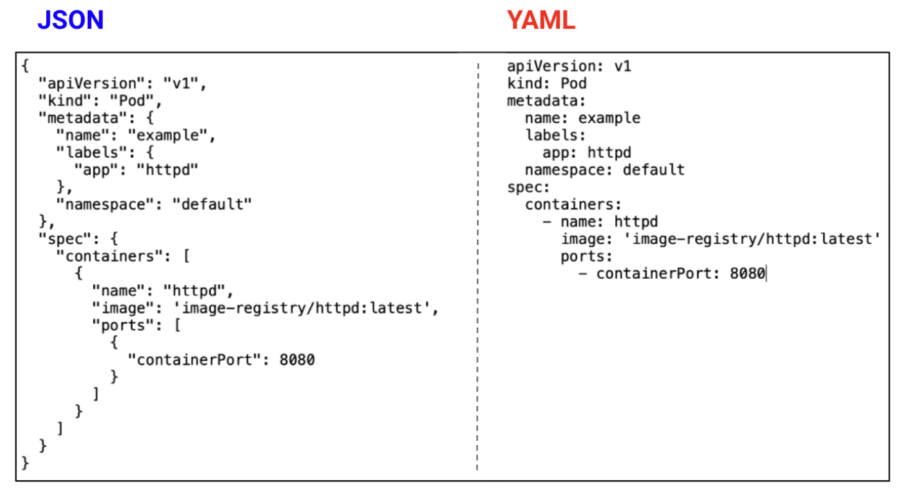
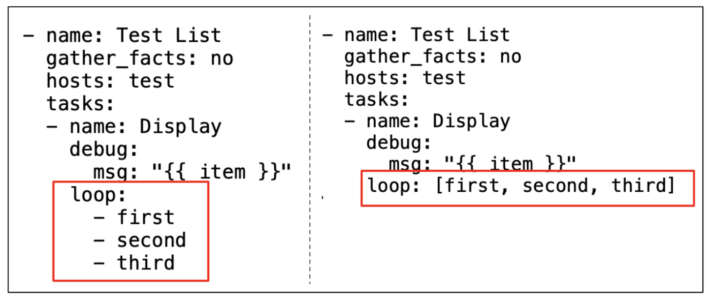
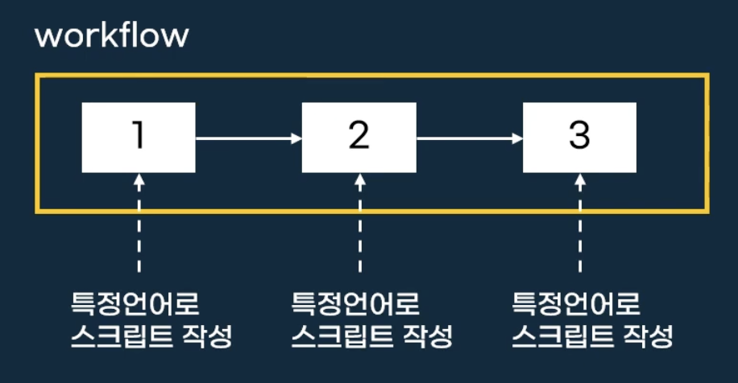
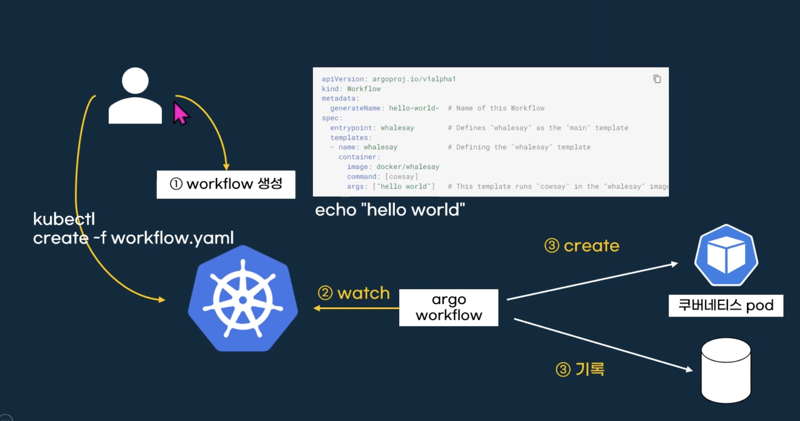
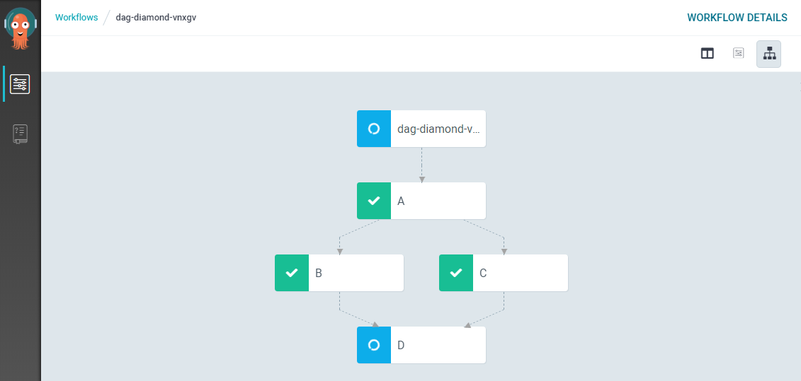

# Today I Learned, 2024.01.18 (THUR)

## Intro.

어제 션께서 yaml 파일을 검토해주셨고, 추가적인 기능 구현을 지시해주셨습니다.

yaml 파일에 슬랙을 연결하는 작업을 진행하기로 하였습니다.

# Main.

yaml 파일을 구현하는데 지난 프리온보딩때보다 더 깊게 yaml 문법 등을 알아보기로했습니다.

---
## [1] Yaml에 대하여,,,

오늘 과제 할 일 목록 중에 가장 메인이 Yaml 파일을 작성하는 것이었기에 yaml 과 친해지는 시간을 가져보기로 하였습니다. 

### 1. Yaml이란 무엇인가요?

- yaml 이란 사람이 읽기 쉽게 만들어진 데이터 직렬화 양식이며, 데이터가 중심인 것이빈다.
- 특히 yaml은 다양한 프로그래밍 언어에서 유래한 기능을 가지고 있으며, 들여쓰기 문법을 지향한다.
- 프론트 개발자인 내가 읽기 쉬운 json 파일 형식과 비교하면 아래와 같다.



- 이 코드는 쿠버네티스에서 파드를 실행하는 코드이다. 여기서 json의 경우에는 괄호가 계층을 나타내기 때문에 코드가 더 길어지고, 불필요한 시각정보(괄호, 따옴표, 콤마 등)으로 인해 가독성이 떨어진다.
- Yaml은 모든 계층을 공백 두칸으로 구분한다. tab을 절대 쓰지 않는다!

### 2. Yaml은 어디에서 쓸까?

- 많은 경우에는 yaml은 구성 파일을 작성할 때 사용한다. 버즈앤비 에서는 쿠버네티스를 위해 사용한다.

### 3. Yaml 기본 문법

1) 기본 형태

- yaml은 기본적으로 “키:값” 형태로 작성된다. 여기에서 주의할점은 콜론(:) 왼쪽에는 공백이 없으며, 오른쪽에는 한칸 이상의 공백이 있어야한다.
- 계층(또는 level이라고도 표현)을 나타낼 때에는 공백이 두칸이다. YAML에서는 괄호 사용이 적은 대신에 계층을 표현하는 것이 굉장히 중요하다. 계층에 대한 레벨도 공백 두칸으로 되어있다.

2) 해시

- 해시는 기본적으로. “키:값”의 한 쌍을 의미하지만 여기에서 이 한 쌍이 여러 개가 사용되면 해시라고도 표현한다. 이 자료형을 특정 키에 대한 값을 반환하는데 어떤 데이터를 찾을 때에는 그 데이터에 해당하는 키를 찾으면 된다.

3) 리스트
   
- 리스트는 여러 개의 데이터를 나열할 때 사용되고 대시(-)로 시작한다. 



---
그리고 argo workflow에 대해서도 더 이해해보고 싶었습니다.

---

### [2] Argo Workflows 에 대해서

공식 문서랑 벨로그 글들을 보면서 필요한 부분을 정리해보았다.

## 1. Core Concepts

- 워크플로우란? 작업 순서를 설정해서 순서대로 실행하는 것을 의미한다.
- cicd 파이프라인과 매우 비슷하다.
- 여기서 argo workflow는 워크플로우를 쿠버네티스럽게 생성하고 Pod로 실행한다.(컨테이너로 실행)



- 각 Job간의 종속성을 부여하여 순서대로 실행할 수 있으며 병렬로 여러 Job을 동시에 실행할 수 있다.
- 차이점은 Job의 단위가 프로세스가 아닌 컨테이너 단위이다.
- Argo workflow에서는 쿠버네티스 선언형 명령 스타일로 CustomResourceDefinition을 정의하고 YAML 파일을 만들어 쿠버네티스에 호출한다. 그러면 Argo workflow controller가 그것을 받아서 DAG를 정의한대로 스케줄링한다.
- 쿠버네티스 자체 Job과의 가장 큰 차이점은 Job간의 종속성을 부여하여 workflow를 실행할 수 있다는 것이다.


(1) argo workflow의 전체의 구조

|구분 |	UI	| 스케줄러|	메세지 큐|	메타데이터 DB	|worker	|DAG 정의|	job 단위|
|:--:|:--:|:--:|:--:|:--:|:--:|:--:|:--:|
|Argo Workflow|	Argo UI|	kube-scheduler|	Argo  Controller|	etcd|	Node	|YAML	|Container |

- Argo workflow는 Job을 실행하기 위한 여러 컴포넌트들을 쿠버네티스 자체 컴포넌트에 의존한다.

(2) 동작 방법



1. 사용자가 yaml dag 명세를 작성해서 쿠버네티스 마스터에 요청을 보낸다.
2. 그럼 쿠버네티스 API 서버가 명세를 받아서 etcd DB에 workflow 정보를 저장한다.
3. Argo workflow가 reconcilation loop에서 etcd DB의 새로운 정보를 확인하고 kube-scheduler에 필요한 Pod를 요청한다.
4. kube-scheduler는 Pod를 적절한 노드에 스케줄링한다.
5. Argo controller가 다음번 reconcilation loop에서 다음 dependency가 걸려 있는 Job을 요청한다.
   
---

## 2. Sean의 지난 주차 과제 리뷰

[Sean’s Assgin Report](https://www.notion.so/Sean-s-Assgin-Report-4e1b1b58d0174032aec837a09d1bd86f?pvs=21) 

Hello World 를 출력하고 터미널에서 고래 만나기!

여기서 workflow는 pod로 실행된다.

---

## 3. workflow 작성하기

### [1] 간단한 워크플로우 작성하는 과정

```yaml
apiVersion: argoproj.io/v1alpha1
kind: Workflow                  
metadata:
  generateName: hello-world- 
spec:
  entrypoint: whalesay         
  templates:
  - name: whalesay
    container:
      image: docker/whalesay
      command: [cowsay]
      args: ["hello world"]
```

지난 주차에 Sean이 출제해주셨던 과제의 yaml 파일이다.

이와 같이 yaml을 정의하고 나서 쿠버네티스 마스터로 호출하면 된다.


```
kubectl create -f hello-world.yaml
```

명령을 호출한 다음에 argo ui 화면으로 들어가면 새로운 워크플로우가 생성된 것을 확인했다 고래도 만났다!

### [2] 단계별 workflow….

워크플로우가 단순하면 매우 좋겠지만 그럴일이 없다 ㅎㅎ

다양한 단계를 지정하는 워크플로우에 대해 알아보자! 바로 오늘 다 완성한 yaml 파일이다.

단계별로 지정되어있는 워크플로우는 매우 복잡하고 이해하기 어려울 수 있다.

크게 template을 정의하는 부분과 (윗 부분) 정의한 template을 사용하는 부분 (아래 부분)으로 나뉜다.

- template 정의부에서 어떤 컨테이너를 사용할지 전달 받은 파라미터를 어디에 사용할지 미리 지정한다.
- template을 활용하는 부분에서는 어떤 순서를 가지고 workflow를 실행할지, 이때 어떤 파라미터 등을 넘길지를 결정한다.

예시는 아래와 같다!


```yaml
apiVersion: argoproj.io/v1alpha1
kind: Workflow
metadata:
  generateName: dag-diamond-
spec:
  entrypoint: diamond             # 시작점 위치
  templates:
  #####################
  # template을 정의합니다.
  #####################
  - name: echo
    inputs:
      parameters:
      - name: message
    container:
      image: alpine:3.7
      command: [echo, ""]
  ####################################
  # 위에서 정의한 template을 사용합니다.
  # 여기에서 DAG 모양을 표현합니다.
  ####################################
  - name: diamond                 # 여기서부터 시작!!
    dag:
      tasks:
      - name: A                   # 먼저 A라는 job을 실행합니다.
        template: echo            # 위에서 정의한 echo template을 이용하여
        arguments:                # 이때 A라는 파라미터를 전달한다.
          parameters: [{name: message, value: A}]
      - name: B                   # B라는 job을 실행하는데
        dependencies: [A]         # A가 완료된 이후에 실행한.
        template: echo
        arguments:
          parameters: [{name: message, value: B}]
      - name: C                   # C도 마찬가지로
        dependencies: [A]         # A가 완료된 이후에 실행한다.
        template: echo
        arguments:
          parameters: [{name: message, value: C}]
      - name: D                   # D는
        dependencies: [B, C]      # B,C가 완료된 이후에 실행한다.
        template: echo
        arguments:
          parameters: [{name: message, value: D}]
```

이 dag를 실행하면 아래와 같이 된다고 한다.



---

오늘 공부한 내용을 토대로 Argo workflow가 어떤 건지, 어떻게 사용하는 것인지 더 잘 이해할 수 있었습니다.

이제 오늘 구현을 완료한 yaml 파일을 가지고 내용을 정리해보았습니다.

### 📝 과제

제가 새로 작성한 yaml 파일은 쿠버네티스 클러스터에서 실행되는 Argo workflow의 CronWorkflow 리소스를 정의하고 있는 설정 파일입니다. Argo workflow를 실행하기 위한 설정이 작성되어있습니다.

1. 파일 기본 정보

```yaml
apiVersion: argoproj.io/v1alpha1
kind: CronWorkflow
metadata:
  namespace: datapipeline
  name: prod-data-devsampling
  labels:
    owner: garden
```

- **apiVersion**: 사용하는 API의 버전을 나타낸다. **`argoproj.io/v1alpha1`**은 Argo Workflow에 사용되는 API 버전이다.
- **kind**: 생성하려는 리소스의 종류를 명시한다.
- **metadata**: 리소스에 대한 메타데이터를 제공한다. 여기에는 쿠버네티스의 네임스페이스, 이름, 라벨 등이 포함된다.

2. 스케줄 설정 

```yaml
spec:
  schedule: "30 13 * * *"
  concurrencyPolicy: "Forbid"
```

- **spec: 우리의**  CronWorkflow의 사양을 결정하게 됩니다.
    - schedule : Cron 형식의 스케줄을 정의하게 되는데 우리는 밤 10시 30분에 작업을 실행하도록 했다.
    - concurrencyPolicy : 동시에 실행하는 정책을 설정한다. Forbid는 이전 작업이 실행 중이라면, 새로운 작업을 시작하지 않음을 의미한다. 이는 다양하게 설정이 가능하다.
  
3. 워크 플로우 사양
 
```yaml
workflowSpec:
    onExit: exit-handler
    retryStrategy:
      retryPolicy: Always
      limit: 3
    imagePullSecrets:
      - name: aws-ecr
    serviceAccountName: plumbers-sa
    entrypoint: main
    templates:
      - name: main
        dag:
          tasks:
            - name: start-notification
              templateRef:
                name: slack-notification-template
                template: start-notification
                clusterScope: true
            - name: devSampling
              dependencies: [start-notification]
              template: run-data-devSampling
      - name: run-data-devsampling
        metadata:
          labels:
            owner: garden
        nodeSelector:
            cloud.google.com/gke-nodepool: nodes
        container:
          name: prod-data-devsampling
          image: 314916389090.dkr.ecr.ap-northeast-2.amazonaws.com/datacomponent:prod.workflow
          imagePullPolicy: "Always"
          command: [ npm, run, dist, devSampling, --, -y]
          env:
            # 환경 변수들...
              - name: CONST_SRC_CHANNEL_INFO
                value: "youtube_channel_info"    
...
```

- **entrypoint**: 워크플로우의 시작점을 나타내는 템플릿의 이름이다.
- **templates**: 워크플로우에서 사용할 템플릿들을 정의한다.
    - **dag**: 방향성 비순환 그래프(DAG)를 이용해 여러 작업들의 실행 순서와 의존성을 정의한다.
    - **container**: 실제로 실행될 컨테이너의 사양을 정의한다.

그리고 우리는 워크플로우를 시작할때 슬랙에 알람을 보내도록 설정했다.

4. 리소스 요구사항 및 볼륨 설정
- **resources**: 컨테이너에 할당할 리소스(예: CPU, 메모리)의 한도와 요청량을 설정하는 것이다.
- **volumeMounts** 및 **volumes**: 컨테이너에서 사용할 볼륨을 마운트하고 정의합니다.

우리는 비밀 정보를 저장하는 볼륨을 사용했다.


```yaml
          resources:
            limits:
              cpu: "500m"
              memory: "800Mi"
            requests:
              cpu: "100m"
              memory: "300Mi"
          volumeMounts:
            - mountPath: "/usr/src/app/secret"
              name: secret-common
              readOnly: true
        volumes:
          - name: secret-common
            secret:
              secretName: prod-secret-common
```

5. 출구 핸들러
- **exit-handler**: 워크플로우가 종료될 때 실행될 작업을 정의한다.
    - 우리는 슬랙 알림을 보내도록 작업을 설정했다.

```yaml
...      
			- name: exit-handler
        steps:
          - - name: slack-notification
              templateRef:
                name: slack-notification-template
                template: end-notification
                clusterScope: true
              arguments:
                parameters:
                  - name: success-message
                    value: true
```