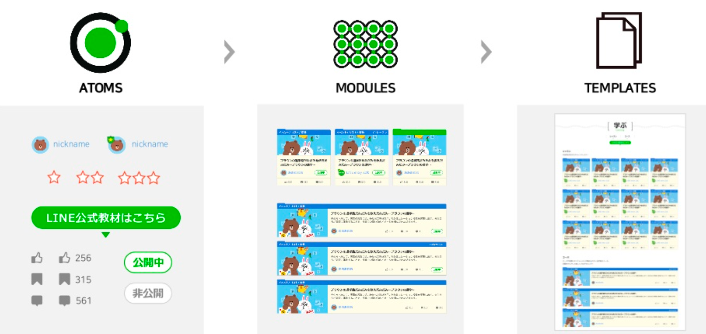

# Today I Learned, 

## Topic, Atomic Design Pattern - Glen

> 수업 날짜: 2024.01.08

### Intro.

컴포넌트들을 모듈화해서 재사용하는 것이 중요해서 해당 디자인 시스템을 고안.

"컴포넌트들의 시스템을 디자인 하는 것이다."

#### 정의.



아토믹 디자인 패턴은 정의하기로는 5개의 단계로 정의한다. 

1. Atoms(원자)

> 먼저 원자는 가장 작은 컴포넌트 단위를 의미한다. 원자는 어떤 context가 주어지든지 이에 해당하는 컴포넌트가 충분히 생성될 수 있어야한다. 다양한 상태를 가지고 있어야하며, 추상적이지만 최대한 포용할 수 있게 설계가 되어야한다. 특히 원자는 마진이나 위치 값을 가지지 않아야한다.


2. Modules(분자)

> 원자를 엮어 조금 복잡한 단위의 분자가 생성된다. 이 분자는 분자만의 프로퍼티를 가지고 있을 수도 잇고, 이를 활용해서 원자에 기능을 만들어 줄 수 있다. 분자가 원자의 위치값을 지정하기도 한다.

3. Organismns

> 유기체는 분자를 엮어 만들어서 생성되고 , 때로는 분자가 되지 않은 원자가 엮이기도 한다. 유기체가 완성되면 컴포넌트가 최종 모습을 가지게 된다. 유기체는 분자와 원자의 위치 값을 조정한다.

4. Templates

> 이 템플릿은 만들어진 유기체의 컴포넌트의 위치를 정해주는 역할을 한다. 템플릿 파일은 주로 페이지를 구성하기 위해 서로 엮여진 유기체 그룹으로 구성되며, 이 부분에서 디자인을 확인하고 레이아웃이 실제로 구동하는지 볼 수 있다. 템플릿에는 스타일링이나 색깔이 들어가지 않는데, 이 템플릿의 역할은 페이지의 그리드를 정해주는 것 뿐이다.

5. Pages

> 페이지는 템플릿을 이용해서 각 그리드에 컴포넌트를 그려서 화면에 노출시킨다. 

---

블링에서는 **많이 사용하는 아토믹의 단계 : Atoms → Organisms → Pages** 단위로 개발을 진행한다. 

여기서 핵심은, 
- 어떤 기능을 만들어도 "공용"으로 만든다고 생각하고 개발하면 된다.

글랜께서 정의해주신 블링 서비스에서는
# 적용 예시

- **Atoms** ( 어떤 느낌인지에 대한 예시 )
    - 다른 컴포넌트를 import 해서 사용하지 않는 순수한 컴포넌트 여야 합니다.
    - N*N 사이즈의 원형 썸네일인 경우, 경로, width, height만 넣으면 완성되게 만듭니다.
    - 여러가지 형식의 button (자율성이 존재하는 버튼 & 바로 가져다 쓸 수 있는 버튼)
- **Organisms**
    - Atoms 를 조합해 만드는 중간단계
    - Atoms, organisms 를 조합해 만드는 중간단계
    - 단계를 줄이다보니 많은 요소가 Organisms에 해당됩니다.
    따라서 최대한 이름또한 공용적인 이름으로 지어주시면 좋습니다.

- Pages
    - 페이지 전체 (src/pages)

이를 주의해서 개발을 진행하면 된다. 

----
저는 여기서 모든 세세한 요소들을 아톰 단위로 분리할 수 있고, 이를 고안하기 힘들지 않을까 생각했습니다
하지만 오늘 수업해주신 Glen께서 다음과 같은 폴더 구조로 개발하는 것을 권장하셨습니다.
스토리북에만 잘 작성한다면 해당 요소들을 보고 협업자도 잘 판단할 수 있지 않을까 생각을 바로 잡았습니다.

```
ㅏcomponents
ㅣ		ㅣ- atoms (folder)
ㅣ		ㅣ			ㄴ Button (folder)
ㅣ		ㅣ						 ㄴ RedButton (folder)
ㅣ		ㅣ 									 ㅏ- RedButton.jsx
ㅣ		ㅣ 									 ㅏ- RedButton.module.scss
ㅣ		ㅣ 									 ㄴ- RedButton.stories.jsx
ㅣ		ㄴ- organisms (folder)
ㅣ          ㄴ Header (folder)
ㅣ                ㅏ Header.js
ㅣ                ㅏ Header.module.scss
ㅣ                ㄴ Header.stories.js
ㅏpages
ㅣ   ㅏ index.js
ㅣ   ㄴ search.js
ㅏstory
ㅣ   ㅏ index.stories.js
ㅣ   ㄴ search.stories.js

```

# Assign
오늘의 과제는 하나의 컴포넌트를 개발하고 이를 atom 디자인 패턴을 적용하는 것을 목적으로 두셨습니다. Atom 단위로 분리하는 게 의문이 많이 들었는데... 나중에 Glen에게 첨삭 받을 때 여쭤보니 제가 걱정하는 부분에 대해서 잘 짚어주셨습니다 ㅠㅠ

우리 블링 서비스의 순위를 나타내는 컴포넌트 UI를 구현하는 것이었습니다!


이 컴포넌트 UI를 구현하면서 atom 단위로 나누어서 구현하고, 과제를 진행할 때에는 아래의 생각으로 코드를 짰습니다.


정말 지저분한 설명이지만 총 3단계로 나누어서 구현하였고, 고정된 값을 제외한 동적인 값만 atom으로 분리해서 구현했다는 말을 길게 한 것입니다..ㅎㅎ


해당 구조로 구현을 하였고, 글랜께 피드백을 받았습니다!
되도록 분리하는게 좋고 storybook에 잘 작성하면 좋다는 말씀을 해주셨습니다 ㅎㅎ

아토믹 디자인 패턴을 간략하게 알아보고, 아톰 단위로 나누어 구현하는 연습을 진행했습니다!
